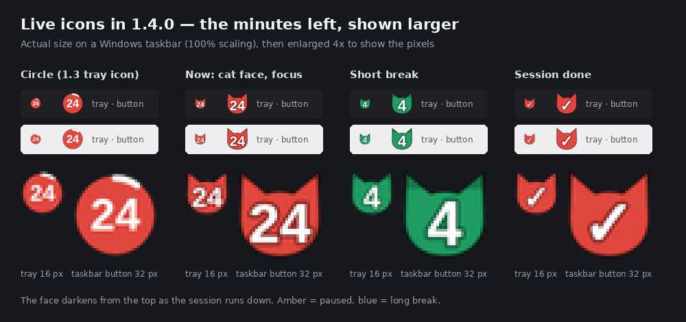
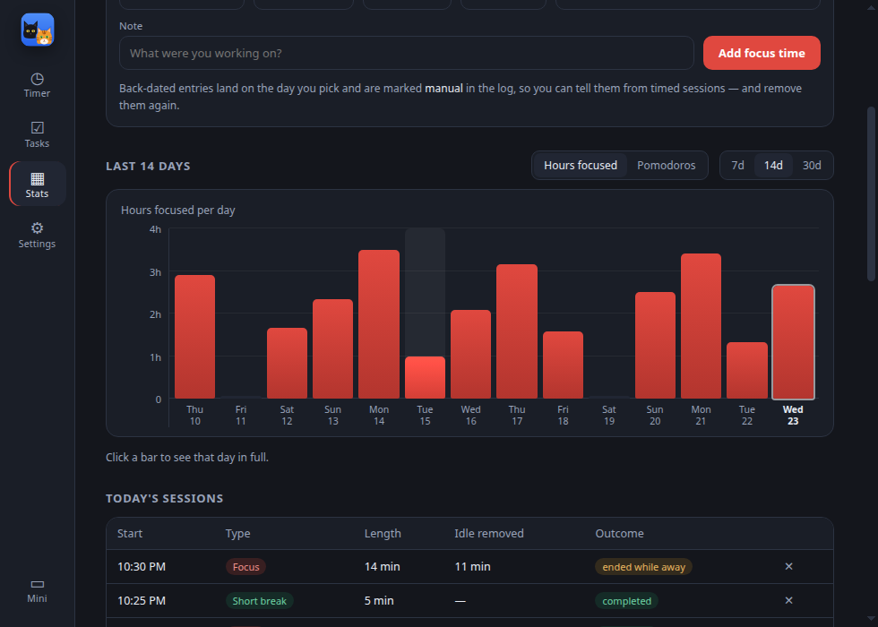
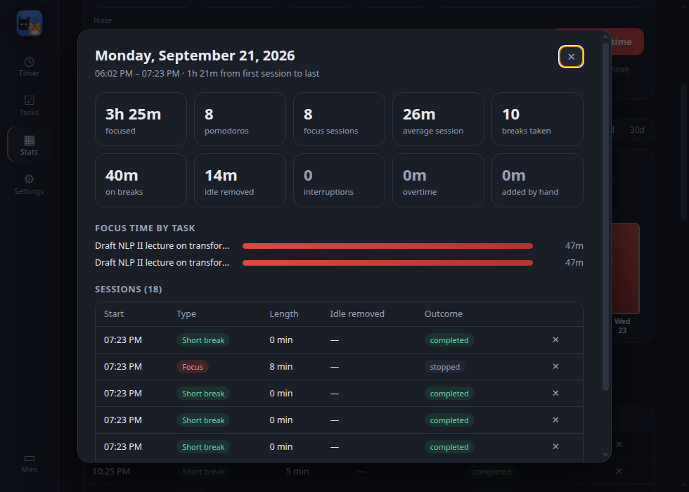
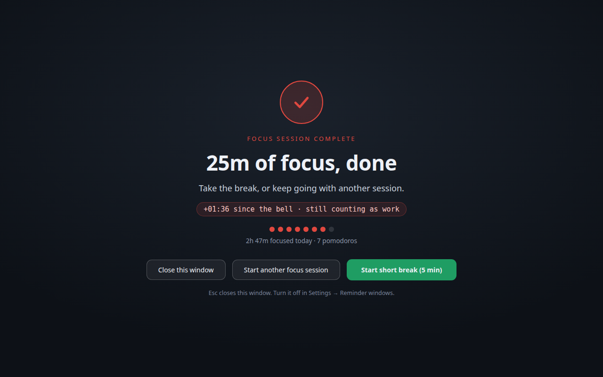
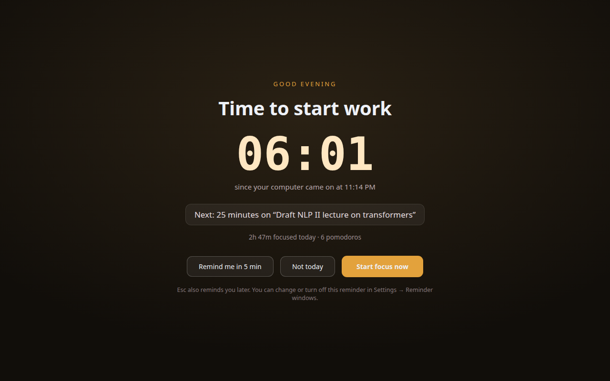
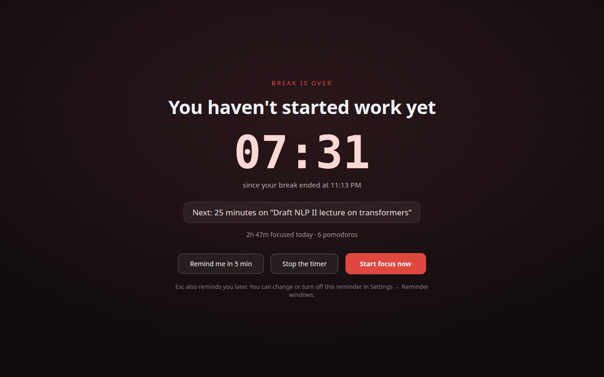

<div align="center">


# Ferna Pomoro

**A Pomodoro timer for Windows that refuses to count time you weren't there.**

[](https://github.com/tgi25/ferna-pomoro/actions/workflows/ci.yml)
[](https://github.com/tgi25/ferna-pomoro/releases/latest)
[](LICENSE)

[](https://buymeacoffee.com/fernasolutions)

[**Download for Windows**](https://github.com/tgi25/ferna-pomoro/releases/latest) · [Update an existing install](#updating-to-a-new-version) · [What it does](#what-it-does) · [Build from source](#running-from-source)

</div>

> **New in 1.5.0:** the history chart now has a labelled vertical axis, switches
> between hours and pomodoros, and opens any day in full when you click its bar.
> [See the statistics](#statistics) · [update now](#updating-to-a-new-version)
>
> **1.4.0** put the minutes left on the taskbar button in a
> [cat-face icon](#the-taskbar-tells-you-how-long-you-have-worked); **1.3.0** added the
> [reminder windows](#reminder-windows).

---

Ferna Pomoro watches Windows' idle counter. The moment you stop touching the
keyboard and mouse, it rewinds your focus clock back to your last keystroke and
freezes it there. When you come back it asks what that gap was — and whichever
answer you give, the numbers in your statistics are true.

<div align="center">


</div>

[**▶ Watch the 70-second demo**](docs/demo.mp4?raw=1) — the whole idea in one video.


---

## Installing

Download **`Ferna-Pomoro-Setup-<version>.exe`** from the
[latest release](https://github.com/tgi25/ferna-pomoro/releases/latest) and run
it. It installs per-user, so it needs no administrator rights, and it offers to
put Ferna Pomoro in the Start menu and on the desktop.
`Ferna-Pomoro-Portable-<version>.exe` runs from a folder or a USB stick without
installing anything. Windows 10 or 11, 64-bit.

Every release also carries `SHA256SUMS.txt`. To check a download:

```powershell
Get-FileHash .\Ferna-Pomoro-Setup-1.5.0.exe -Algorithm SHA256
```

The installer is not code-signed — a certificate costs more than this project
does — so SmartScreen shows "Windows protected your PC" the first time. Choose
**More info → Run anyway**. The installers are built by
[GitHub Actions](.github/workflows/release.yml) straight from this repository,
so you can see exactly what went into them.

Upgrading from 1.0 ("Pomora"): install this alongside it and your statistics,
tasks and settings are carried over automatically on first launch. The old entry
can then be uninstalled from Apps & features.

Your data lives in `%APPDATA%\Ferna Pomoro\pomora-data.json` and survives
upgrades. Uninstalling leaves it in place; delete the folder to remove it.

### Updating to a new version

1. Download the new **`Ferna-Pomoro-Setup-<version>.exe`** from the
   [latest release](https://github.com/tgi25/ferna-pomoro/releases/latest).
2. **Quit Ferna Pomoro first.** Right-click its tray icon (near the clock) and
   choose **Quit**. Closing the window only hides it to the tray, and the
   installer can't replace a running app.
3. Run the installer. On *"Windows protected your PC"*, choose
   **More info → Run anyway**.
4. It installs over the old version. Your statistics, tasks and settings are
   kept, so you don't need to uninstall first.
5. Open Ferna Pomoro and look at the bottom of **Settings**. It shows the version
   you are running.

Using the portable build? Download the new `Ferna-Pomoro-Portable-<version>.exe`
and use it instead of the old one. Your data lives in `%APPDATA%`, not next to
the `.exe`, so nothing is lost.

---

## What it does

### The Pomodoro cycle

Focus 25 / short break 5 / long break 15 after every 4 pomodoros — all
adjustable. Breaks can start automatically while the next focus session waits
for you to say go (the default), or the other way round, or neither.

When a focus session ends and auto-start is off, the clock keeps counting **up**
in overtime rather than sitting at zero: if you were mid-thought at the bell,
that extra work is recorded too, as a separate overtime entry.

### Idle detection, and taking the idle time back out

This is the part worth reading.

While a **focus** session runs, Ferna Pomoro polls the system idle time once a second.
Cross the threshold (5 minutes by default) and it:

1. rewinds the focus clock by exactly the time since your last input, and
2. pauses the session at that instant.

So the clock stops at your last keystroke, not at the moment of detection, and
nothing accrues while you are gone. A session can never complete, and a break
can never auto-start, while nobody is at the machine.

When you touch the keyboard again, you get the question:


| Choice | Effect |
| --- | --- |
| **Remove the idle time and carry on** | The pomodoro resumes exactly where you left it. |
| **Count it as work** | The gap is added back — for reading, thinking or a phone call away from the desk. |
| **End the pomodoro where I left** | Logs the focus time up to your departure and stops, with the session marked *ended while away*. |
| **End it and start a break** | Treats the gap as the start of a break. |
| **Leave it paused** | Stays frozen until you say go. |

Tick *Always do this without asking* and the answer becomes the default; you can
also pick the policy up front in Settings (ask / remove silently / always count
as work / end the pomodoro).

**Sleep, hibernation and locking are covered too.** Ferna Pomoro watches for gaps
between its own ticks, so if the laptop lid closes for three hours, that gap is
treated as away-time — the same freeze, the same question on return. It does not
rely on the app being awake.

### Focus time you forgot to track

The timer only knows about sessions you started. For the ones you did not —
marking scripts at the kitchen table, an hour of reading before you opened the
laptop — **Statistics → Forgot to start the timer?** takes the date, the start
time, the length, how many pomodoros to credit, an optional task and a note.

Two things make this trustworthy rather than a way to fool yourself:

- The entry is **back-dated to the day it happened**, so a Tuesday session you
  remember on Thursday lands on Tuesday's bar in the chart, not Thursday's.
- It is stored and shown as **manual**, distinct from timed work, with its own
  "added by hand today" figure and its own tag in the session log and the CSV.
  Nothing pretends a hand-typed hour is the same as a measured one.

Every row in the session log — manual or timed — has a ✕ that removes it and
unwinds everything it contributed: the day's focus time, the pomodoro count, the
task's total. Mistyped entries do not have to live in your history.

### Alerts

Four distinct toasts, each with its own synthesised chime:

| Alert | When | Buttons on the toast |
| --- | --- | --- |
| **Work Alert** 🍅 | a focus session begins | Pause · Skip |
| **Short Break Alert** ☕ | a pomodoro ends, short break next | Start break · +5 min work · Skip |
| **Long Break Alert** 🌿 | the long break is due | Start long break · Skip |
| **Back to work** ⏰ | a break has run out | Start focus · +5 min break |

And the one that most apps miss: **when you actually start working again after a
break**, Ferna Pomoro says so (▶️ *Back at it — focus started*) — a separate alert from
the break-over nudge, because the two are different moments.

If the break runs out while you are away from the desk, the back-to-work nudge
does not fire into an empty room. It waits, and greets you when you return
(👋 *Welcome back*) — or, if auto-start is on, starts the next focus session at
the moment you sit down rather than ten minutes earlier.

Sounds are generated from scratch by `tools/make-assets.py`: a rising fifth for
work, a soft falling third for short breaks, three warm descending tones for the
long one, a lifting arpeggio for back-to-work. Volume is adjustable, and there is
an optional ticking clock.

### The taskbar tells you how long you have worked

Five indicators, all live:

- **The taskbar button's icon shows the minutes left**, in large white digits on
  a cat face coloured by the phase: red for focus, green for a short break, blue
  for a long one, amber when paused. A ✓ appears when the session is done. This
  is the biggest number Windows allows an app to put on the taskbar (24–32 px),
  so it is readable at a glance. With nothing running, the normal app icon
  returns.
- **The taskbar button fills** with the progress of the current session — green
  while focusing, yellow while paused or on a break, red when in overtime.
- **A badge on the corner of the button** carries today's work. It shows the
  pomodoro count by default; you can switch it to *time worked today* (`2h`) or
  *minutes left in this session*. While the button icon is showing the time,
  the badge steps aside so it doesn't cover the digits.
- **Hovering the taskbar button** gives the full line: `Focus: 17:42 left ·
  Focused 2h 39m today · 6 pomodoros · 17m idle removed`, and the thumbnail
  preview gets **start/pause, skip and stop buttons** you can press without
  opening the window.
- **The window title counts down** (`17:42 · Focus — Ferna Pomoro`), so the time is
  readable from the taskbar and from Alt-Tab.

The tray icon is drawn live too, in the same cat shape, with the minutes left
and today's totals in its tooltip. Windows keeps tray icons at 16 px, so the
digits are made as large as that allows. The face darkens from the top as the
session runs down.



**Settings → Taskbar & tray** turns the button countdown on or off and switches
both icons between **Cat face** and the older **Circle**. For a bigger clock
still, the mini timer (`Ctrl+Alt+M`) floats on top of other windows.

### Statistics

Today's figures across the top — focus time, pomodoros, idle removed,
interruptions, the last seven days, the day streak and time added by hand — then
the history chart:



The **vertical axis is labelled**, with gridlines, so a bar's height is a number
you can read rather than a shape you have to guess at. The axis rounds up to a
sensible top (whole or half hours, never 2.5 of an hour) and keeps the tallest
bar inside the plot. Two switches sit above it: **Hours focused** or
**Pomodoros**, and **7 / 14 / 30 days**. Today's bar is outlined, and each bar is
labelled with its weekday and date.

**Click any bar and that day opens in full:**



- When the day started and ended, and how long it ran from the first session to
  the last.
- Focus time, pomodoros, how many focus sessions, and the average session.
- **Breaks actually taken** (and how many were long ones), and the time spent on
  them.
- Idle time removed, interruptions, overtime, and time added by hand.
- **Focus time by task**, as a small bar per task.
- Every session of that day, with its outcome — including the ones that ended
  while you were away — and a ✕ to remove any entry, which unwinds the day's
  totals with it.

**← Previous day** and **Next day →** walk through the history without going back
to the chart; Esc closes the popup. Everything here is also in the **CSV export**.

### The break window, on your terms

The break window covers the screen so a break is actually a break. Three
separate switches in Settings decide how firmly:

| Setting | What it does |
| --- | --- |
| **Show the full-screen break window** | Off means breaks pass quietly, with only the alert and the taskbar. |
| **Let me close it and keep the break running** | Adds **Close this window** (and Esc). The window goes away, **the break carries on** — the tray, taskbar and mini timer keep counting it down, and the break still ends when it ends. Use it when something behind the curtain needs a glance. |
| **Let me end the break early from it** | Adds **Back to work now**, which does end the break and start the next focus session. |

The two are deliberately different actions: closing the window is not skipping
the break. Once closed, **Show break screen** appears on the Timer pane and in
the tray menu to bring it back, and if the break ends while the window is closed
you still get told, so work never resumes silently.

### Reminder windows

Three full-screen windows, like the break window, cover the moments a Pomodoro
day usually slips. Each has its own switch in **Settings → Reminder windows**, so
you can turn any of them off. That card also has a **Preview** button for each.

| Window | When it appears | Buttons |
| --- | --- | --- |
| **Session complete** | A focus session or a break has just ended | Start the break (or focus) · the other one instead · Close |
| **Time to start work** | You switched on the computer, and nothing has started after a set time (5 min by default) | Start focus now · Remind me in N min · Not today |
| **You haven't started work yet** | A break ended, and focus still hasn't started after a set time (5 min by default) | Start focus now · Remind me in N min · Stop the timer |

#### Session complete



When a focus session ends, the window says how much focus was logged and shows
today's pomodoros against your daily goal. It offers the break that is due, or
another focus session instead. If *Keep counting after the bell* is on, it also
shows the overtime that is still counting as work. When a break ends, it offers
the next focus session (with the task you are on), or five more minutes of break.
**Close this window** (or Esc) leaves the timer waiting. You can decide later from
the Timer pane or the tray.

If the break starts by itself (*Start breaks automatically*), the break window
takes this role: a line at the top says *✓ Focus session complete · 25m logged*.
With the break window turned off, the Session complete window appears instead and
says the break has started, with a **Skip the break** button. The same goes the
other way. If focus starts by itself after a break, the window says so and offers
**5 more minutes of break**.

#### "Time to start work" — after switching on



When the computer comes on, wakes from sleep (opening a laptop's lid counts), or
you open Ferna Pomoro, a countdown starts. If no focus session or break has
started when it runs out, this window appears. It counts up from when the
computer came on and shows what is next. **Not today** puts it away until the next
time the computer is switched on.

It only works if Ferna Pomoro is running, so turn on **Start Ferna Pomoro when
Windows starts** (Settings → Taskbar & tray). The Reminder windows card offers a
one-click **Turn it on** while that setting is off. Like the other reminder, it
waits while you are away from the computer.

#### "You haven't started work yet" — after a break

A break ends and the back-to-work alert goes off. You swipe it away and mean to
start in a minute. Twenty minutes later nothing has started. The toast is easy to
dismiss, so Ferna Pomoro follows it up with something that is not.

If the next focus session still hasn't started a set time after the break ended
(5 minutes by default), a full-screen window like the break window comes up on
every monitor:



It counts up the time since the break ended and shows what is next. It has three
buttons:

| Button | Effect |
| --- | --- |
| **Start focus now** | Starts the next focus session and closes the window. |
| **Remind me in N min** | Closes the window and brings it back after the same delay. Esc does the same. |
| **Stop the timer** | Ends the cycle. Use it when you are done for the day. |

It will not scold you for time you were not there. If you leave the computer
after the break, the delay starts again from when you come back, and a laptop
that has just woken from sleep gets the same grace. Starting focus any other way
(the tray, a shortcut, the toast) cancels it. The Timer pane shows it too:
*Break ended 7 min ago*.

It only applies when focus waits for you after a break. If *Start the next focus
session automatically* is on, there is nothing to wait for.

### Tasks, statistics, and the rest

- **Tasks** with estimated pomodoros; the selected task collects the focus time
  and pomodoro count of every session you run against it.
- **Statistics**: see below.
- **Full-screen break window** across every monitor, with a rotating suggestion
  (*look 20 feet away for 20 seconds*) — see below.
- **Mini timer**: a small always-on-top clock you can park in a corner.
- **Global shortcuts**: `Ctrl+Alt+P` start/pause, `Ctrl+Alt+S` skip,
  `Ctrl+Alt+M` mini timer.
- Minimise/close to tray, start with Windows, daily goal with its own alert.


---

## Running from source

```bash
npm install
npm start          # run the app
npm test           # 65 unit tests: engine, idle watcher, store, reminders, icons, chart
npm run dist       # build the Windows installer (needs Wine on Linux)
python3 tools/make-assets.py   # regenerate sounds and icons
```

`npx electron . --selftest` drives the whole app inside Electron — windows, the
canvas-drawn taskbar images, the full idle freeze/return path, the break-window
dismissal, the three reminder windows, the live icons, manual time entry, the
day-detail query and the IPC surface — 84 checks, ending in a
pass/fail summary. `--screenshots` writes `docs/shots/`.

### How it is laid out

```
src/
  shared/      constants and time formatting, used by both processes
  main/
    engine.js        the timer state machine — pure, no Electron, fully tested
    idle-watcher.js  turns idle-second readings into away-episodes
    nudge.js         decides when to say "time to start" (after a break, after switching on)
    store.js         atomic JSON persistence, daily aggregates, CSV export
    taskbar.js       progress bar, overlay badge, thumbnail toolbar, title
    image-factory.js draws the badge/tray/glyph PNGs at runtime
    notifier.js      Windows toasts with action buttons
    windows.js       window construction
    main.js          wiring: events, IPC, tray, idle policy, power events
  preload/     the only bridge to the UI (contextIsolation, sandboxed)
  renderer/    timer, tasks, stats, settings, mini, break curtain, idle prompt,
               "time to start" reminder, "session complete" window
               chart.js — axis maths for the history chart, unit-tested
```

Two design decisions carry most of the reliability:

**The clock is computed from wall time, never accumulated from ticks.** Elapsed
time is `accumulated + (now - startedAt)`, so a throttled, delayed or skipped
tick cannot make the timer drift. When a phase completes, the end is anchored to
the moment it *should* have ended, so a late tick does not steal seconds from
the next phase.

**The engine knows nothing about Electron.** It takes a clock function, so the
tests run a 4-hour work day in milliseconds, including the awkward paths: a
pomodoro frozen overnight, idle removed past zero, overtime frozen while away.

---

## Releasing

Tag and push; the Windows installer builds on GitHub's runners and attaches
itself to the release:

```bash
npm version patch          # or minor / major — updates package.json
git push && git push --tags
```

The workflow runs the test suite first, so a tag that fails the tests never
produces an installer.

## Contributing

Issues and pull requests are welcome. The engine is covered by unit tests
(`npm test`); anything that touches timing should come with one, because the
whole point of this app is that its numbers can be trusted.

## Credits

Ideas borrowed, and where from: the idle question is Toggl Track's, applied to a
pomodoro instead of a time entry; the break curtain is Stretchly's; overtime
after the bell is Pomotodo's; task-linked pomodoro counts are Focus To-Do's;
the taskbar progress bar is what Windows has always offered and few apps use.

MIT licensed. Built for TGI Fernando.

## Changelog

**1.5.0**
- The history chart has a labelled vertical axis with gridlines, and switches
  between hours focused and pomodoros over 7, 14 or 30 days.
- Clicking a bar opens that day in full: focus time, sessions, breaks taken,
  idle removed, overtime, time by task and the day's session log.

**1.4.0**
- The taskbar button's own icon shows the minutes left, in large digits on a cat
  face coloured by the phase.
- The tray icon is a cat face too, with larger digits than the old circle.
- Settings → Taskbar & tray: turn the button countdown on or off, and choose
  **Cat face** or **Circle**.

**1.3.0**
- *Time to start work*: a full-screen window when the computer has been switched on
  (or woken, or the app opened) and nothing has started after a delay you choose.
- *Session complete*: a full-screen window at the end of every focus session and
  break, with the next step, the alternative, or Close.
- All three reminder windows now share one card, **Settings → Reminder windows**,
  each with its own switch and a preview button.

**1.2.0**
- A full-screen "You haven't started work yet" window when a break has ended and
  focus still hasn't started after a delay you choose (Settings → Reminder windows).
- "+5 min break" on the break-over alert now gives you five more minutes of break.
  Before, it did nothing because the break had already ended.

**1.1.0**
- Renamed to Ferna Pomoro, with the new cat icon; data from Pomora 1.0 is
  carried over on first run.
- Manual focus-time entry, back-dated, marked `manual`, with per-entry deletion
  that unwinds the statistics correctly.
- The break window can be closed without ending the break, reopened from the
  Timer pane or the tray, and each of its two exits is its own setting.

**1.0.0** — first release.

## Support

Ferna Pomoro is free and always will be. If it saves you some honest hours,
you can [buy me a coffee](https://buymeacoffee.com/fernasolutions).
